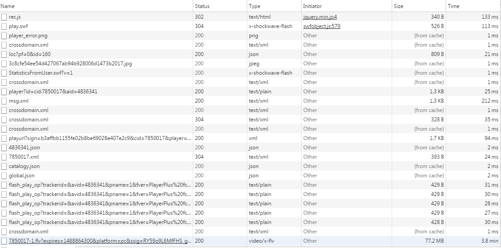
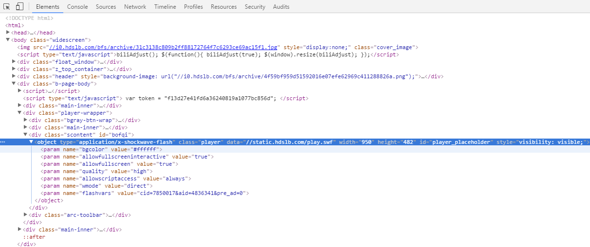
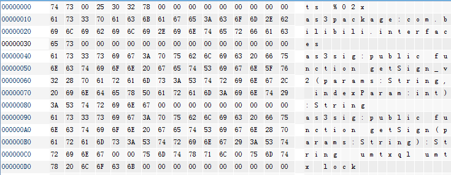

bilibili
===========================

000
---------------------------
事情的起因是这样的。我比较喜欢美国的一个科技类节目《流言终结者》。Adam and Jamie, I'm your fans. 因为实在太喜欢了，就动了念头想把整个剧集都下载下来永久收藏。百度了一下发现B站上还比较完整，一共有248集。网上搜索了一下说可以在浏览器缓存里找到视频文件。但是你需要一集一集点过来并且耐心等待他放完。200多集每集40分钟，这要多久呀，有没有什么别的方法呢？

001
---------------------------
打开开发者工具抓了所有的http请求得到了如下的列表。原本有140多个request, 去掉图片，css以及一些已知的js库，再去掉刷新后可以从cache里直接加载的文件，剩下的没有几个了。



如图所示最后一个就是flv文件的url。带了很多参数。

```
http://cn-jsks5-dx.acgvideo.com/vg8/d/e4/7850017-1.flv?expires=1488864300&platform=pc&ssig=RY59o9L6MfFHS_geAl4c5w&oi=1960979570&nfa=B2jsoD9cEoAmG7KPYo7s2g==&dynamic=1&rnd=0%2E013287325855344534
```

搜索了一下，这个url，发现他可以在下面这个请求所返回的xml文件里找到。

```
https://interface.bilibili.com/playurl?sign=b3affbb1155fe02b8be69028e407e2c9&cid=7850017&player=1&ts=1488850040
```

```xml
<?xml version="1.0" encoding="UTF-8"?>
<video>
	<result>suee</result>
	<timelength>2819262</timelength>
	<format>flv</format>
	<accept_format><![CDATA[mp4,hdmp4,flv]]></accept_format>
	<accept_quality><![CDATA[3,2,1]]></accept_quality>
	<from><![CDATA[local]]></from>
	<seek_param><![CDATA[start]]></seek_param>
	<seek_type><![CDATA[offset]]></seek_type>
	<durl>
		<order>1</order>
		<length>334411</length>
		<size>80927745</size>
		<url><![CDATA[http://cn-jsks5-dx.acgvideo.com/vg8/d/e4/7850017-1.flv?expires=1488864300&platform=pc&ssig=RY59o9L6MfFHS_geAl4c5w&oi=1960979570&nfa=B2jsoD9cEoAmG7KPYo7s2g==&dynamic=1]]></url>
		<backup_url>
		<url><![CDATA[http://cn-zjwz2-dx-v-03.acgvideo.com/vg2/e/5f/7850017-1.flv?expires=1488864300&platform=pc&ssig=JePHX8BUu6sVHLoJXzZhTQ&oi=1960979570&nfa=B2jsoD9cEoAmG7KPYo7s2g==&dynamic=1]]></url>
		<url><![CDATA[http://cn-zjwz2-dx.acgvideo.com/vg17/e/db/7850017-1.flv?expires=1488864300&platform=pc&ssig=OT5gu7rHk22S0J-3wAVZPw&oi=1960979570&nfa=B2jsoD9cEoAmG7KPYo7s2g==&dynamic=1]]></url>
		</backup_url>
	</durl>
	...
<video>
```

这个请求也是从某个flash中发出的，它带的参数少多了。sign可能是一个验证字符串用于判断请求是不是合法。如果修改一下某个参数而不修改sign的值就会得到checksum error的错误信息。


url中的ts应该是当前时间。cid应该是剧集的id。它的值可以在这个页面中找到。

```
http://www.bilibili.com/video/av4836341/
```

```html
<script type='text/javascript'>EmbedPlayer('player', "//static.hdslb.com/play.swf", "cid=7850017&aid=4836341&pre_ad=0");</script>
```

4836341就是aid。也就是流言终结者这部剧的id。这里的javascript代码应该会在网页中嵌入一个flash对象。可以直接从开发者工具-〉elements里找被javascript创建出来的那个对象



所以现在只要弄明白sign的值是怎么计算的，就可以写脚本来批量下载视频了。

下载那个play.swf (其实还有一个叫StatisticsFromUser.swf也在请求列表中，但是看名字不像就没有去管它)。用JPEXS Free Flash Decompiler打开这个flash文件，可以反编译看见ActionScript的源代码。搜索关键字"sign"，没有直接找到拼接url时类似于"sign="的常量字符串。但找到了两个函数很可疑，getSign()和getSign_v2()。

```
import com.bilibili.interfaces.getSign;
import com.bilibili.interfaces.getSign_v2;

```

搜索这两个字符串找到所有的调用者。找到一下这些函数。

```
org.lala.utils.PlayerTools
      public function loadCidVideo(param1:String, param2:Object = null) : void
      public function loadBStream(param1:String) : void
      public function loadPlayurl(param1:String) : void
      public function loadPreview(param1:String, param2:Object = null) : void
tv.bilibili.net.ClickService
      private function _send(param1:String, param2:int, param3:Object) : void
```

经过仔细判断鉴别发现最终的那个playurl是由函数loadCidVideo生成的。sign的方法是getSign

```actionscript
         var _loc4_:String = this.getCidVideoInfoUrl(param1);
         var _loc5_:Array = _loc4_.split("?");
         var _loc6_:String = getSign(_loc5_[1] + "&player=1");
         var _loc7_:URLRequest = new URLRequest(_loc5_[0] + "?" + _loc6_);
```
getSign接受一个类似于"cid=7850017&ts=1488850040&player=1"字符串， 返回"sign=b3affbb1155fe02b8be69028e407e2c9&cid=7850017&player=1&ts=1488850040"这样的字符串。找到getSign的源代码

```actionscript
   public function getSign(param1:String) : String
   {
      var _loc2_:* = 0;
      var _loc4_:* = null;
      var _loc7_:int = 0;
      var _loc8_:int = 0;
      var _loc6_:int = 0;
      var _loc5_:int = 0;
      var _loc3_:* = int(ESP);
      _loc2_ = _loc3_;
      _loc3_ = int(_loc3_ - 48);
      _loc5_ = 16;
      _loc6_ = _loc2_ - 37;
      ESP = _loc3_ & -16;
      _loc7_ = CModule.mallocString(param1);
      _loc8_ = param1.length;
      do
      {
         var _loc9_:* = int(L__2E_str2 - _loc5_);
         _loc9_ = li8(_loc9_ + 16);
         _loc3_ = int(_loc3_ - 16);
         si32(_loc9_,_loc3_ + 4);
         si32(_loc6_,_loc3_);
         ESP = _loc3_;
         F_sprintf();
         _loc3_ = int(_loc3_ + 16);
         _loc5_ = _loc5_ + -1;
         _loc6_ = _loc6_ + 2;
      }
      while(_loc5_ != 0);
      
      _loc3_ = int(_loc3_ - 16);
      _loc9_ = int(_loc2_ - 4);
      si32(_loc9_,_loc3_ + 12);
      _loc9_ = int(_loc2_ - 37);
      si32(_loc9_,_loc3_ + 8);
      si32(_loc8_,_loc3_ + 4);
      si32(_loc7_,_loc3_);
      ESP = _loc3_;
      F_get_sign();
      _loc3_ = int(_loc3_ + 16);
      _loc5_ = eax;
      _loc9_ = li32(_loc2_ - 4);
      _loc4_ = CModule.readString(_loc5_,_loc9_);
      if(_loc7_ != 0)
      {
         _loc3_ = int(_loc3_ - 16);
         si32(_loc7_,_loc3_);
         ESP = _loc3_;
         F_idalloc();
         _loc3_ = int(_loc3_ + 16);
      }
      if(_loc5_ != 0)
      {
         _loc3_ = int(_loc3_ - 16);
         si32(_loc5_,_loc3_);
         ESP = _loc3_;
         F_idalloc();
         _loc3_ = int(_loc3_ + 16);
      }
      var _loc10_:* = _loc4_;
      _loc3_ = _loc2_;
      ESP = _loc3_;
      return _loc10_;
   }
```

等等这个代码怎么这么奇怪？ESP是什么鬼？EAX又是什么鬼？？还有sprintf？？？

002
---------------------------

貌似这里运用了一个高深的技术（也许并不高深，是我孤陋寡闻了）。某个工具可以将dll文件转换成ActionScript代码。每一条x86指令都会被翻译成若干条AS的代码。比如说
```actionscript
      var _loc3_:* = int(ESP);
      _loc2_ = _loc3_;
```
其实就是"MOV EBP, ESP"
```actionscript
      _loc3_ = int(_loc3_ - 48);
```
其实就是"SUB ESP, 48"。以此类推。

这个工具同时会将数据段变成一个embeded binary file加到swf文件里。这样AS代码就可以访问数据段的数据了。这真是太有意思了。

我费了好大功夫终于渐渐适应了这种代码风格并且弄明白这个函数在做什么。先来看这一段:
```actionscript
      _loc5_ = 16;
      _loc6_ = _loc2_ - 37;
      do
      {
         var _loc9_:* = int(L__2E_str2 - _loc5_);
         _loc9_ = li8(_loc9_ + 16);
         _loc3_ = int(_loc3_ - 16);
         si32(_loc9_,_loc3_ + 4);
         si32(_loc6_,_loc3_);
         ESP = _loc3_;
         F_sprintf();
         _loc3_ = int(_loc3_ + 16);
         _loc5_ = _loc5_ + -1;
         _loc6_ = _loc6_ + 2;
      }
      while(_loc5_ != 0);
```
这段代码中访问了一个指针"L__2E_str2", 经过搜索这个指针指向了原始dll的一个数据段".rodata.str1.16" + 偏移量32


可以看到这个指针指向的数据非常可疑。这段代码对从L__2E_str2开始的16个字节的每一个字节调用F_sprintf(), 结果放保存esp-37的位置上。看上去像是转16进制字符串。但是奇怪的是调用sprintf之前只压栈了两个值。并没有找到springf的第一个参数fmt。看看F_sprintf()的代码发现它调用了F___vfprintf()，并且第二个参数是指针L__2E_str13。而L__2E_str13指向了".rodata"段的第三个字节。

```actionscript
      _loc2_ = int(_loc2_ - 16);
      si32(_loc3_,_loc2_ + 8);
      si32(L__2E_str13,_loc2_ + 4);
      si32(_loc4_,_loc2_);
      ESP = _loc2_;
      F___vfprintf();
```

看到这里我就放心了。所以之前getSign()的第一大段应该是将一段二进制数据转换成16进制字符串。我们给这个字符串起一个名字叫key。


003

--------------------------

The End
