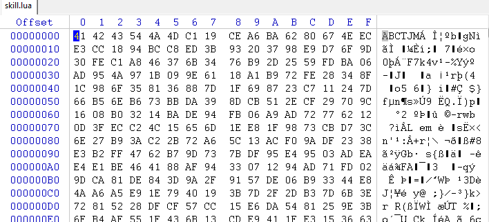
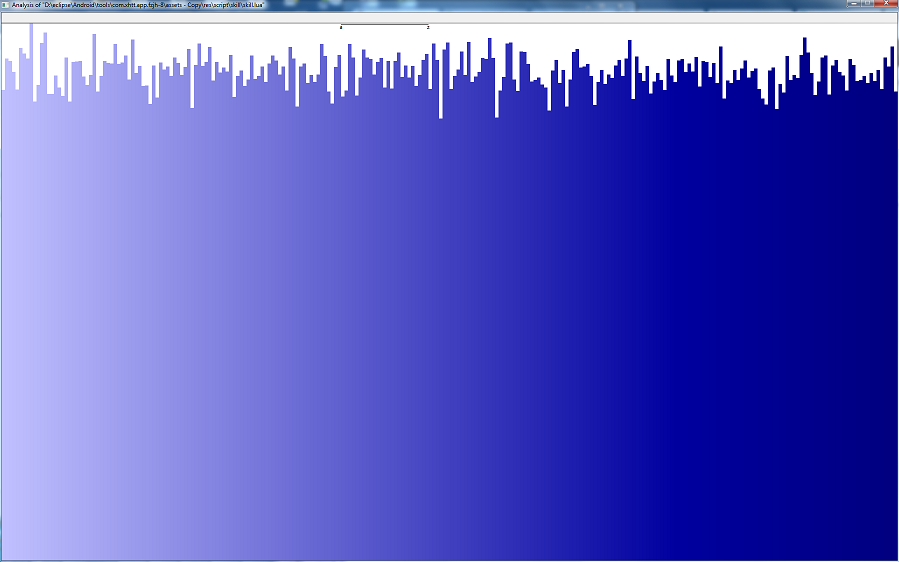
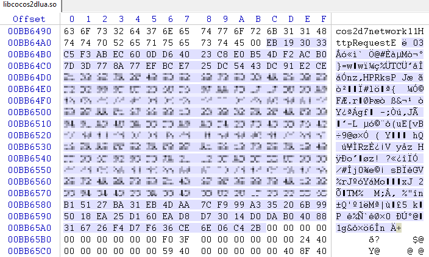
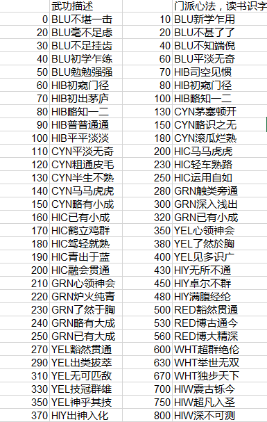

放置江湖
===========================


000
---------------------------
放置江湖是深圳小猴跳跳出品的一款文字类武侠Mud游戏。我在TapTap上下载的。玩了之后一下子就触动了我一段久远的记忆。这个游戏非常像我高中时候在文曲星上玩得叫gmud的游戏。记得当时花了非常多的时间在这个游戏上(其实是因为上课太无聊)。当时的文曲星用的是2032的纽扣电池，一节电池要5块钱。我在这个游戏上用光了几十节电池。那时候为了能干掉武学修为达到返璞归真级别的张三丰，我开始修改游戏。从修改游戏数据到修改游戏图片到直接修改游戏代码。最后我练就了可以人肉6502指令集的汇编和反汇编技术。我会把大段代码抄在纸上分析，然后改完以后再写回到Rom里。现在想想真是疯狂啊。

言归正传。我玩了几天后发现网上的攻略都没有具体数值。于是想把这个游戏拆开看看。


001
---------------------------
放置江湖目前只能通过TapTap下载. 在TapTap里设置禁用自动删除安装包后, 游戏安装包可以在下面这个位置找到。
```
    Android/data/com.taptap/files/Download/taptaptmp/
```
下载安装包后解压缩。首先看到的是这个文件
```
    lib/armeabi/libcocos2dlua.so
```
看来游戏应该是基于cocos2dx的。随后在assets目录下发现了很多lua脚本以及图片资源。图片没有加密，直接都可以看到，但这不是我想要的。随便打开一个Lua脚本。看到如下内容

	

不认识这个文件。网上搜索ABCTJM也没有发现任何线索。看一下每个字节出现的频率



这个文件不是压缩了就是加密了。加密的可能性更大一些。鉴于lib下的那个文件的文件名是libcocos2dlua.so，这些扩展名是lua的文件应该是处理过的脚本文件。现在目标是弄明白这个文件是怎样压缩和加密的。不用废话了，直接开始反汇编吧。

```
  objdump -CT libcocos2dlua.so > fzjh.sym
  objdump -Cd libcocos2dlua.so > fzjh.asm
```

从cocos2d::cocos2dVersion()看到如下反汇编：
 
```asm
 007364f8 <cocos2d::cocos2dVersion()>:
  7364f8:	4801      	ldr	r0, [pc, #4]	; (736500 <cocos2d::cocos2dVersion()+0x8>)
  7364fa:	4478      	add	r0, pc
  7364fc:	4770      	bx	lr
```


736500地址的值是47F533。将这个值加上7364fe等于BB5A31


这里就是版本号了。可以看到版本号是cocos2dx 3.9。来到cocos2dx的github上把3.9下载下来开始对照代码读汇编，效率果然高。

```
    https://github.com/cocos2d/cocos2d-x
```

通过在符号表中搜索"key", "decrypt"等关键字，很快就找到了一些线索。

cocos2d::LuaStack::executeScriptFile() 会调用 cocos2d::LuaStack::luaLoadBuffer() 然后调用了 xxtea_encrypt()进行解密。貌似对lua加密是cocos2dx内置的功能。

```cpp
int LuaStack::executeScriptFile(const char* filename)
{
    CCAssert(filename, "CCLuaStack::executeScriptFile() - invalid filename");
   
    std::string buf(filename);
    //
    // remove .lua or .luac
    //
    size_t pos = buf.rfind(BYTECODE_FILE_EXT);
    if (pos != std::string::npos)
    {
        buf = buf.substr(0, pos);
    }
    else
    {
        pos = buf.rfind(NOT_BYTECODE_FILE_EXT);
        if (pos == buf.length() - NOT_BYTECODE_FILE_EXT.length())
        {
            buf = buf.substr(0, pos);
        }
    }
    
    FileUtils *utils = FileUtils::getInstance();
    //
    // 1. check .lua suffix
    // 2. check .luac suffix
    //
    std::string tmpfilename = buf + NOT_BYTECODE_FILE_EXT;
    if (utils->isFileExist(tmpfilename))
    {
        buf = tmpfilename;
    }
    else
    {
        tmpfilename = buf + BYTECODE_FILE_EXT;
        if (utils->isFileExist(tmpfilename))
        {
            buf = tmpfilename;
        }
    }
    
    std::string fullPath = utils->fullPathForFilename(buf);
    Data data = utils->getDataFromFile(fullPath);
    int rn = 0;
    if (!data.isNull())
    {
        if (luaLoadBuffer(_state, (const char*)data.getBytes(), (int)data.getSize(), fullPath.c_str()) == 0)
        {
            rn = executeFunction(0);
        }
    }
    return rn;
}

int LuaStack::luaLoadBuffer(lua_State *L, const char *chunk, int chunkSize, const char *chunkName)
{
    int r = 0;
    
    if (_xxteaEnabled && strncmp(chunk, _xxteaSign, _xxteaSignLen) == 0)
    {
        // decrypt XXTEA
        xxtea_long len = 0;
        unsigned char* result = xxtea_decrypt((unsigned char*)chunk + _xxteaSignLen,
                                              (xxtea_long)chunkSize - _xxteaSignLen,
                                              (unsigned char*)_xxteaKey,
                                              (xxtea_long)_xxteaKeyLen,
                                              &len);
        r = luaL_loadbuffer(L, (char*)result, len, chunkName);
        free(result);
    }
    else
    {
        r = luaL_loadbuffer(L, chunk, chunkSize, chunkName);
    }
    return r;
}
```

仔细读了一下源代码，发现密钥 xxteaKey必须要通过调用setXXTEAKeyAndSign()方法来设置。但是奇怪的是全局搜了都没有找到有调用过这个函数的地方。寻找密钥的过程在这里遇到了第一个困难。


002
---------------------------
回来继续看反汇编代码。因为objdump对arm的代码识别不怎么好，所以里面有很多错误的symbol。这个需要注意识别。比如说cocos2d::TextureAtlas::increaseTotalQuadsWith(int)+0xf54 就完全不知所云。而在源代码里面这里写的是strncmp()。进去看了一下，这个地方有点像plt table，但又不是plt。最糟糕的是那里应该是ARM指令而不是Thumb指令，objdump完全搞错了，所以没有办法深究了。

```asm
00471f7c <cocos2d::LuaStack::luaLoadBuffer(lua_State*, char const*, int, char const*, char const*)>:
  471f7c:	b5f0      	push	{r4, r5, r6, r7, lr}
  471f7e:	1c1e      	adds	r6, r3, #0
  471f80:	7f03      	ldrb	r3, [r0, #28]
  471f82:	b087      	sub	sp, #28
  471f84:	1c05      	adds	r5, r0, #0
  471f86:	1c0f      	adds	r7, r1, #0
  471f88:	1c14      	adds	r4, r2, #0
  471f8a:	2b00      	cmp	r3, #0
  471f8c:	d013      	beq.n	471fb6 <cocos2d::LuaStack::luaLoadBuffer(lua_State*, char const*, int, char const*, char const*)+0x3a>
  471f8e:	6ac3      	ldr	r3, [r0, #44]	; 0x2c
  471f90:	6aa9      	ldr	r1, [r5, #40]	; 0x28
  471f92:	1c10      	adds	r0, r2, #0
  471f94:	1c1a      	adds	r2, r3, #0
  471f96:	9303      	str	r3, [sp, #12]
  471f98:	f298 fd46 	bl	70aa28 <cocos2d::TextureAtlas::increaseTotalQuadsWith(int)+0xf54>
  471f9c:	2800      	cmp	r0, #0
  471f9e:	d10a      	bne.n	471fb6 <cocos2d::LuaStack::luaLoadBuffer(lua_State*, char const*, int, char const*, char const*)+0x3a>
  471fa0:	9b03      	ldr	r3, [sp, #12]
  471fa2:	9005      	str	r0, [sp, #20]
  471fa4:	6a2a      	ldr	r2, [r5, #32]
  471fa6:	18e0      	adds	r0, r4, r3
  471fa8:	ac05      	add	r4, sp, #20
  471faa:	1af1      	subs	r1, r6, r3
  471fac:	6a6b      	ldr	r3, [r5, #36]	; 0x24
  471fae:	9400      	str	r4, [sp, #0]
  471fb0:	f08c fb50 	bl	4fe654 <xxtea_decrypt(unsigned char*, unsigned int, unsigned char*, unsigned int, unsigned int*)>
  471fb4:	e00c      	b.n	471fd0 <cocos2d::LuaStack::luaLoadBuffer(lua_State*, char const*, int, char const*, char const*)+0x54>
  471fb6:	2300      	movs	r3, #0
  471fb8:	1c20      	adds	r0, r4, #0
  471fba:	1c31      	adds	r1, r6, #0
  471fbc:	9305      	str	r3, [sp, #20]
  471fbe:	f7e5 fdeb 	bl	457b98 <JM::isEncrypted(unsigned char*, unsigned int)>
  471fc2:	2800      	cmp	r0, #0
  471fc4:	d010      	beq.n	471fe8 <cocos2d::LuaStack::luaLoadBuffer(lua_State*, char const*, int, char const*, char const*)+0x6c>
  471fc6:	1c20      	adds	r0, r4, #0
  471fc8:	1c31      	adds	r1, r6, #0
  471fca:	aa05      	add	r2, sp, #20
  471fcc:	f7e5 fe92 	bl	457cf4 <JM::decrypt(unsigned char*, unsigned int, unsigned int*)>
  471fd0:	1c05      	adds	r5, r0, #0
  471fd2:	9a05      	ldr	r2, [sp, #20]
  471fd4:	1c38      	adds	r0, r7, #0
  471fd6:	1c29      	adds	r1, r5, #0
  471fd8:	9b0c      	ldr	r3, [sp, #48]	; 0x30
  471fda:	f298 fb03 	bl	70a5e4 <cocos2d::TextureAtlas::increaseTotalQuadsWith(int)+0xb10>
  471fde:	1c04      	adds	r4, r0, #0
  471fe0:	1c28      	adds	r0, r5, #0
  471fe2:	f297 fe2b 	bl	709c3c <cocos2d::TextureAtlas::increaseTotalQuadsWith(int)+0x168>
  471fe6:	e006      	b.n	471ff6 <cocos2d::LuaStack::luaLoadBuffer(lua_State*, char const*, int, char const*, char const*)+0x7a>
  471fe8:	1c21      	adds	r1, r4, #0
  471fea:	1c38      	adds	r0, r7, #0
  471fec:	1c32      	adds	r2, r6, #0
  471fee:	9b0c      	ldr	r3, [sp, #48]	; 0x30
  471ff0:	f298 faf8 	bl	70a5e4 <cocos2d::TextureAtlas::increaseTotalQuadsWith(int)+0xb10>
  471ff4:	1c04      	adds	r4, r0, #0
  471ff6:	1c20      	adds	r0, r4, #0
  471ff8:	b007      	add	sp, #28
  471ffa:	bdf0      	pop	{r4, r5, r6, r7, pc}
```

认真看了一遍才发现，这个竟然和cocos2dx的源代码不一样。看来小猴跳跳的人是修改了cocos2dx的源代码。他们没有使用原先解密方法，取而代之的是调用了一个JM::decrypt()的方法。确认传入的三个参数分别为密文，密文长度和明文长度，明文是通过返回值传出的。所以密钥应该是在这个函数内部取得。

```asm
00457cf4 <JM::decrypt(unsigned char*, unsigned int, unsigned int*)>:
  457cf4:	b5f0      	push	{r4, r5, r6, r7, lr}
  457cf6:	4e18      	ldr	r6, [pc, #96]	; (457d58 <JM::decrypt(unsigned char*, unsigned int, unsigned int*)+0x64>)
  457cf8:	b0a7      	sub	sp, #156	; 0x9c
  457cfa:	1c05      	adds	r5, r0, #0
  457cfc:	447e      	add	r6, pc
  457cfe:	6836      	ldr	r6, [r6, #0]
  457d00:	1c0c      	adds	r4, r1, #0
  457d02:	6833      	ldr	r3, [r6, #0]
  457d04:	1c17      	adds	r7, r2, #0
  457d06:	9325      	str	r3, [sp, #148]	; 0x94
  457d08:	f7ff ff46 	bl	457b98 <JM::isEncrypted(unsigned char*, unsigned int)>
  457d0c:	9603      	str	r6, [sp, #12]
  457d0e:	2800      	cmp	r0, #0
  457d10:	d00f      	beq.n	457d32 <JM::decrypt(unsigned char*, unsigned int, unsigned int*)+0x3e>
  457d12:	ae05      	add	r6, sp, #20
  457d14:	1c21      	adds	r1, r4, #0
  457d16:	1c32      	adds	r2, r6, #0
  457d18:	ab04      	add	r3, sp, #16
  457d1a:	1c28      	adds	r0, r5, #0
  457d1c:	f7ff fe9c 	bl	457a58 <JM::gdk(unsigned char*, unsigned int, unsigned char*, unsigned int*)>
  457d20:	9904      	ldr	r1, [sp, #16]
  457d22:	9700      	str	r7, [sp, #0]
  457d24:	1c32      	adds	r2, r6, #0
  457d26:	1868      	adds	r0, r5, r1
  457d28:	2380      	movs	r3, #128	; 0x80
  457d2a:	1a61      	subs	r1, r4, r1
  457d2c:	f0a6 fc92 	bl	4fe654 <xxtea_decrypt(unsigned char*, unsigned int, unsigned char*, unsigned int, unsigned int*)>
  457d30:	e009      	b.n	457d46 <JM::decrypt(unsigned char*, unsigned int, unsigned int*)+0x52>
  457d32:	1c20      	adds	r0, r4, #0
  457d34:	f2b1 ff4e 	bl	709bd4 <cocos2d::TextureAtlas::increaseTotalQuadsWith(int)+0x100>
  457d38:	1c06      	adds	r6, r0, #0
  457d3a:	1c29      	adds	r1, r5, #0
  457d3c:	1c22      	adds	r2, r4, #0
  457d3e:	f2b1 ff51 	bl	709be4 <cocos2d::TextureAtlas::increaseTotalQuadsWith(int)+0x110>
  457d42:	1c30      	adds	r0, r6, #0
  457d44:	603c      	str	r4, [r7, #0]
  457d46:	9b03      	ldr	r3, [sp, #12]
  457d48:	9a25      	ldr	r2, [sp, #148]	; 0x94
  457d4a:	681b      	ldr	r3, [r3, #0]
  457d4c:	429a      	cmp	r2, r3
  457d4e:	d001      	beq.n	457d54 <JM::decrypt(unsigned char*, unsigned int, unsigned int*)+0x60>
  457d50:	f2b1 ff7c 	bl	709c4c <cocos2d::TextureAtlas::increaseTotalQuadsWith(int)+0x178>
  457d54:	b027      	add	sp, #156	; 0x9c
  457d56:	bdf0      	pop	{r4, r5, r6, r7, pc}
  457d58:	5264      	strh	r4, [r4, r1]
  457d5a:	0086      	lsls	r6, r0, #2
```
最终还是调用了xxtea_decrypt这个函数来解密的。这个函数的第三个参数就是密钥。

```asm
  457d12:	ae05      	add	r6, sp, #20
  457d24:	1c32      	adds	r2, r6, #0
  457d28:	2380      	movs	r3, #128	; 0x80
```

通过以上这几行可知密钥被存在了局部变量sp+20的位置上。他的长度是128字节。显然这个密钥是通过JM::gdk的第三个参数传出的。让我们看一下JM::gdk这个函数做了什么？

```asm
00457a58 <JM::gdk(unsigned char*, unsigned int, unsigned char*, unsigned int*)>:
  457a58:	b5f0      	push	{r4, r5, r6, r7, lr}
  457a5a:	4d2f      	ldr	r5, [pc, #188]	; (457b18 <JM::gdk(unsigned char*, unsigned int, unsigned char*, unsigned int*)+0xc0>)
  457a5c:	1c14      	adds	r4, r2, #0
  457a5e:	447d      	add	r5, pc
  457a60:	682d      	ldr	r5, [r5, #0]
  457a62:	b093      	sub	sp, #76	; 0x4c
  457a64:	1e01      	subs	r1, r0, #0
  457a66:	682a      	ldr	r2, [r5, #0]
  457a68:	9211      	str	r2, [sp, #68]	; 0x44
  457a6a:	d04c      	beq.n	457b06 <JM::gdk(unsigned char*, unsigned int, unsigned char*, unsigned int*)+0xae>
  457a6c:	780a      	ldrb	r2, [r1, #0]
  457a6e:	2a41      	cmp	r2, #65	; 0x41
  457a70:	d126      	bne.n	457ac0 <JM::gdk(unsigned char*, unsigned int, unsigned char*, unsigned int*)+0x68>
  457a72:	784a      	ldrb	r2, [r1, #1]
  457a74:	2000      	movs	r0, #0
  457a76:	2a42      	cmp	r2, #66	; 0x42
  457a78:	d145      	bne.n	457b06 <JM::gdk(unsigned char*, unsigned int, unsigned char*, unsigned int*)+0xae>
  457a7a:	788a      	ldrb	r2, [r1, #2]
  457a7c:	2a43      	cmp	r2, #67	; 0x43
  457a7e:	d142      	bne.n	457b06 <JM::gdk(unsigned char*, unsigned int, unsigned char*, unsigned int*)+0xae>
  457a80:	78ca      	ldrb	r2, [r1, #3]
  457a82:	2a54      	cmp	r2, #84	; 0x54
  457a84:	d13f      	bne.n	457b06 <JM::gdk(unsigned char*, unsigned int, unsigned char*, unsigned int*)+0xae>
  457a86:	790a      	ldrb	r2, [r1, #4]
  457a88:	2a4a      	cmp	r2, #74	; 0x4a
  457a8a:	d13c      	bne.n	457b06 <JM::gdk(unsigned char*, unsigned int, unsigned char*, unsigned int*)+0xae>
  457a8c:	794a      	ldrb	r2, [r1, #5]
  457a8e:	2a4d      	cmp	r2, #77	; 0x4d
  457a90:	d139      	bne.n	457b06 <JM::gdk(unsigned char*, unsigned int, unsigned char*, unsigned int*)+0xae>
  457a92:	2001      	movs	r0, #1
  457a94:	2c00      	cmp	r4, #0
  457a96:	d036      	beq.n	457b06 <JM::gdk(unsigned char*, unsigned int, unsigned char*, unsigned int*)+0xae>
  457a98:	2206      	movs	r2, #6
  457a9a:	4e20      	ldr	r6, [pc, #128]	; (457b1c <JM::gdk(unsigned char*, unsigned int, unsigned char*, unsigned int*)+0xc4>)
  457a9c:	af01      	add	r7, sp, #4
  457a9e:	601a      	str	r2, [r3, #0]
  457aa0:	447e      	add	r6, pc
  457aa2:	1c31      	adds	r1, r6, #0
  457aa4:	2240      	movs	r2, #64	; 0x40
  457aa6:	1c38      	adds	r0, r7, #0
  457aa8:	f2b2 f89c 	bl	709be4 <cocos2d::TextureAtlas::increaseTotalQuadsWith(int)+0x110>
  457aac:	1c31      	adds	r1, r6, #0
  457aae:	1c20      	adds	r0, r4, #0
  457ab0:	3140      	adds	r1, #64	; 0x40
  457ab2:	2240      	movs	r2, #64	; 0x40
  457ab4:	f2b2 f896 	bl	709be4 <cocos2d::TextureAtlas::increaseTotalQuadsWith(int)+0x110>
  457ab8:	1c20      	adds	r0, r4, #0
  457aba:	1c39      	adds	r1, r7, #0
  457abc:	3040      	adds	r0, #64	; 0x40
  457abe:	e01e      	b.n	457afe <JM::gdk(unsigned char*, unsigned int, unsigned char*, unsigned int*)+0xa6>
  457ac0:	2000      	movs	r0, #0
  457ac2:	2a54      	cmp	r2, #84	; 0x54
  457ac4:	d11f      	bne.n	457b06 <JM::gdk(unsigned char*, unsigned int, unsigned char*, unsigned int*)+0xae>
  457ac6:	784a      	ldrb	r2, [r1, #1]
  457ac8:	2a4a      	cmp	r2, #74	; 0x4a
  457aca:	d11c      	bne.n	457b06 <JM::gdk(unsigned char*, unsigned int, unsigned char*, unsigned int*)+0xae>
  457acc:	788a      	ldrb	r2, [r1, #2]
  457ace:	2a4d      	cmp	r2, #77	; 0x4d
  457ad0:	d119      	bne.n	457b06 <JM::gdk(unsigned char*, unsigned int, unsigned char*, unsigned int*)+0xae>
  457ad2:	2001      	movs	r0, #1
  457ad4:	2c00      	cmp	r4, #0
  457ad6:	d016      	beq.n	457b06 <JM::gdk(unsigned char*, unsigned int, unsigned char*, unsigned int*)+0xae>
  457ad8:	2203      	movs	r2, #3
  457ada:	4f11      	ldr	r7, [pc, #68]	; (457b20 <JM::gdk(unsigned char*, unsigned int, unsigned char*, unsigned int*)+0xc8>)
  457adc:	ae01      	add	r6, sp, #4
  457ade:	601a      	str	r2, [r3, #0]
  457ae0:	447f      	add	r7, pc
  457ae2:	1c39      	adds	r1, r7, #0
  457ae4:	2240      	movs	r2, #64	; 0x40
  457ae6:	1c30      	adds	r0, r6, #0
  457ae8:	f2b2 f87c 	bl	709be4 <cocos2d::TextureAtlas::increaseTotalQuadsWith(int)+0x110>
  457aec:	1c39      	adds	r1, r7, #0
  457aee:	1c20      	adds	r0, r4, #0
  457af0:	3140      	adds	r1, #64	; 0x40
  457af2:	2240      	movs	r2, #64	; 0x40
  457af4:	f2b2 f876 	bl	709be4 <cocos2d::TextureAtlas::increaseTotalQuadsWith(int)+0x110>
  457af8:	1c20      	adds	r0, r4, #0
  457afa:	1c31      	adds	r1, r6, #0
  457afc:	3040      	adds	r0, #64	; 0x40
  457afe:	2240      	movs	r2, #64	; 0x40
  457b00:	f2b2 f870 	bl	709be4 <cocos2d::TextureAtlas::increaseTotalQuadsWith(int)+0x110>
  457b04:	2001      	movs	r0, #1
  457b06:	9a11      	ldr	r2, [sp, #68]	; 0x44
  457b08:	682b      	ldr	r3, [r5, #0]
  457b0a:	429a      	cmp	r2, r3
  457b0c:	d001      	beq.n	457b12 <JM::gdk(unsigned char*, unsigned int, unsigned char*, unsigned int*)+0xba>
  457b0e:	f2b2 f89d 	bl	709c4c <cocos2d::TextureAtlas::increaseTotalQuadsWith(int)+0x178>
  457b12:	b013      	add	sp, #76	; 0x4c
  457b14:	bdf0      	pop	{r4, r5, r6, r7, pc}
```

这个函数最开始一部分代码检查了密文的前六个字符是不是“ABCTJM”，这正好是那个加密过的lua文件的前六个字节。So Excited! 胜利就在眼前。457ad6这条指令判断了返回指针是否为空。然后代码从数据区加载了一个指针到r7。经过计算这个指针的值是BB64AC

```asm
  457ada:	4f11       	ldr	r7, [pc, #68]
  457ae0:	447f      	add	r7, pc
```

察看一下这个地址的内容，发现这个指针指向的这堆数据很可疑:smile:



继续看代码。下面这个函数symbol是错误的，它带了3个参数。根据这个函数的第一个参数是目标地址，第二个参数是源地址，第三个参数是长度64， 我估计应该是libc里的某个函数比如说memcpy。

```asm
  bl	709be4 <cocos2d::TextureAtlas::increaseTotalQuadsWith(int)+0x110>
```

如果我猜的没错的话，那个这段代码的逻辑是将BB64AC开始的64字节拷贝到一个局部变量数组中sp+4中，然后将后64字节拷贝到返回数组的一开始。最后将栈里的64字节也复制到返回数组中。这样正好是128字节。所以不出意外的话，这就是密钥了。

让我们来验证一下。废了点功夫才找到的xxtea_decrypt的源代码。他在cocos2d的另一个项目里

```
   https://github.com/cocos2d/cocos2d-x-3rd-party-libs-bin/tree/v3/xxtea
```

然后写了一个小程序，使用了下面的key来解密lua文件。注意要先去掉前6个字节的signature。然后就意料之中的成功了。

```cpp
unsigned char xxteakey[128] = {
	0x17, 0xBC, 0xD3, 0xA9, 0x46, 0xC6, 0x2E, 0x72, 0x9F, 0xD8, 0xDE, 0xE6, 0xF2, 0x11, 0xDF, 0x26,
	0xAC, 0xB9, 0xA0, 0xF2, 0x59, 0xBF, 0xAA, 0xC1, 0x67, 0x66, 0x83, 0x10, 0x2D, 0x3B, 0xD2, 0xFA,
	0x2C, 0x4A, 0xC3, 0x09, 0x94, 0x91, 0xAD, 0x4C, 0x0A, 0xB5, 0xF3, 0xA9, 0xA8, 0xF4, 0x28, 0x75,
	0x45, 0x5B, 0x76, 0x42, 0xF7, 0x39, 0x40, 0xF8, 0xD7, 0xD3, 0x06, 0x28, 0x04, 0x59, 0x89, 0x9C,
	0xEB, 0x19, 0x30, 0x33, 0xC5, 0xF3, 0xAB, 0xEC, 0x60, 0x0D, 0xD6, 0x40, 0x23, 0xC8, 0xE0, 0xB5,
	0x4D, 0xF2, 0xAC, 0xB0, 0x7D, 0x3D, 0x77, 0x8A, 0x77, 0xEF, 0xBC, 0xE7, 0x25, 0xDC, 0x54, 0x43,
	0xDC, 0x91, 0xE2, 0xCE, 0xE1, 0xD3, 0x6E, 0x7A, 0x2C, 0x48, 0x50, 0x52, 0x6B, 0x73, 0x50, 0x0D,
	0x4A, 0xE6, 0x0B, 0xE3, 0xF2, 0xB2, 0x99, 0x9F, 0xCF, 0x23, 0x6C, 0xF6, 0x97, 0xAA, 0x7B, 0x17
};
```

003
--------------------------

之后我用python写了一个脚本遍历所有lua文件并全部都解开。然后制作了一个excel表格，收集了游戏中的各种数据。终于心满意足了。




什么？改游戏这种事情我是不屑于做的啦。

The End
